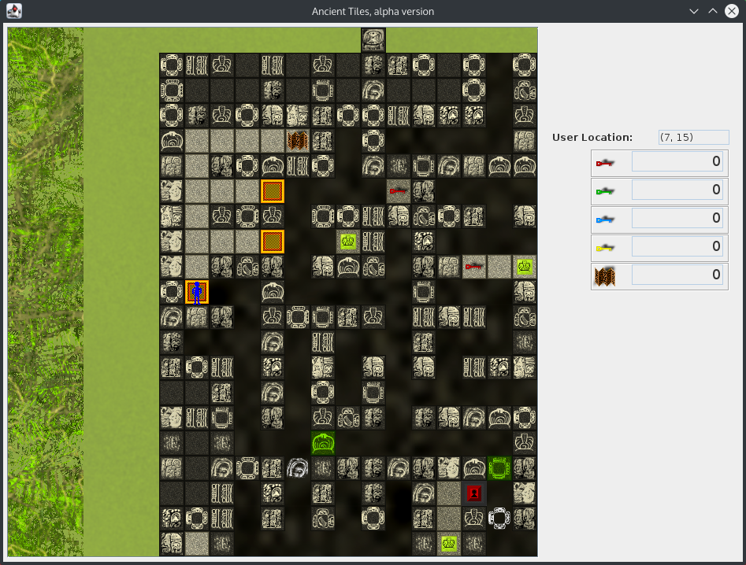
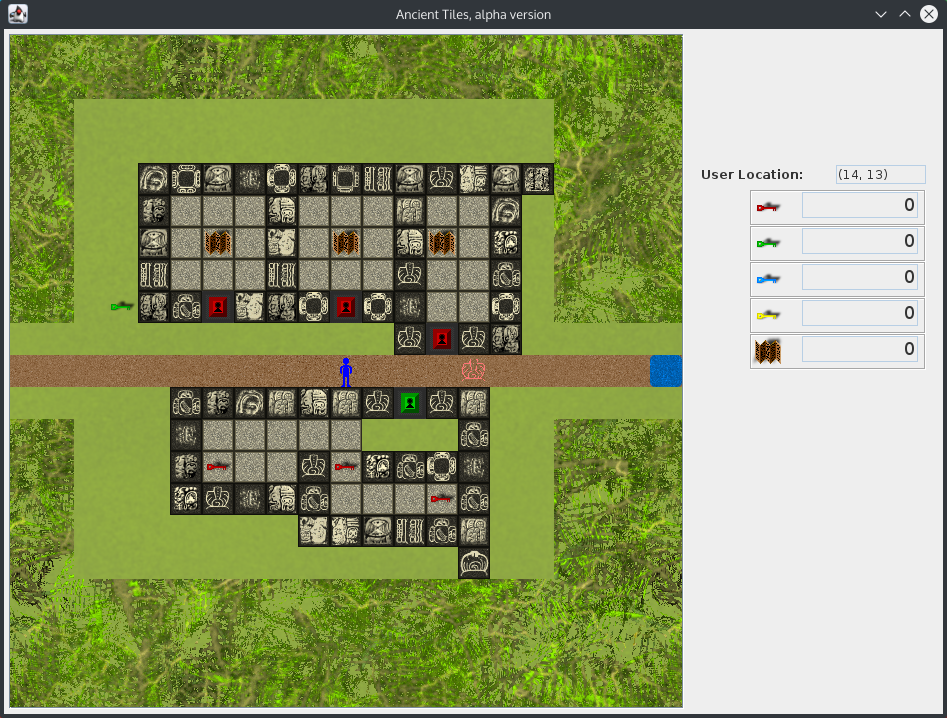

ancient-tiles-java
==================

Ancient Tiles is a Java game similar in the same genre as the old Chip's Challenge game.  The graphics are original and were created using the [GIMP](http://www.gimp.org/).  The current version is stable, but does not allow you to save games or load additional maps from the UI.

### Screenshots

